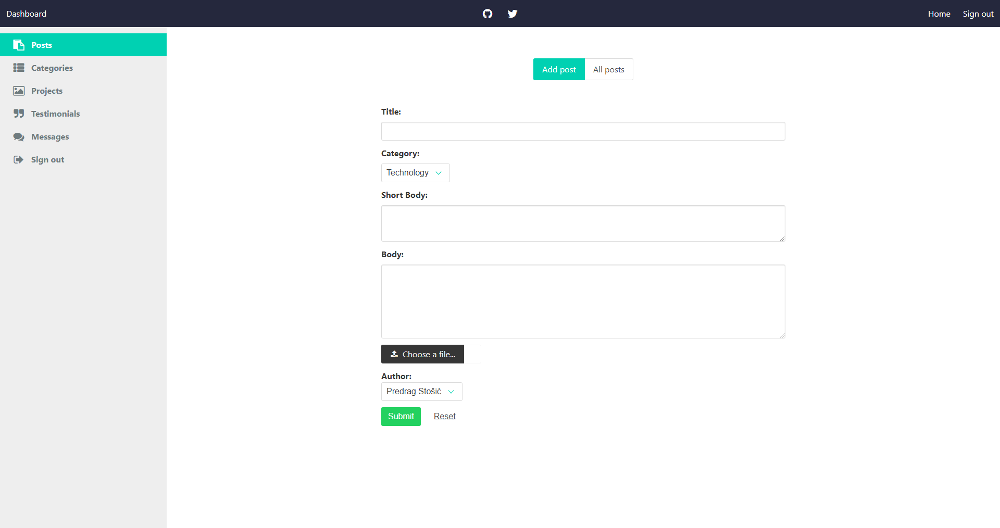

# Portfolio in node.js

This is portfolio website featuring personal blog with backend written in node.js, using express and mongoDB as database. It contains some crud and cms features like (more will be added soon): 

- Adding, editing and removing posts
- Adding and removing categories 
- Editing portfolio section*
- Editing testimonials*
- Messages*
- Admin user authentication*

*this features will be added soon

## Some screenshots:

### Landing Page:

---

---

### Add post page 

---

